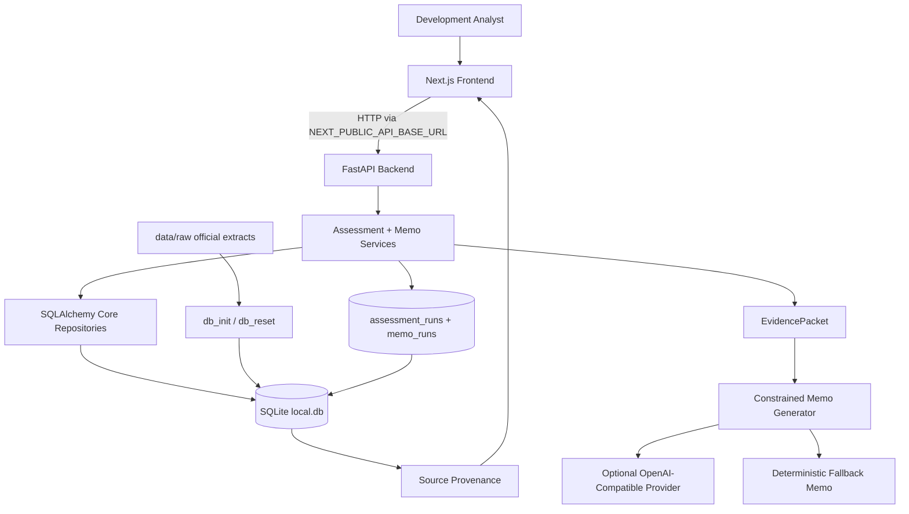
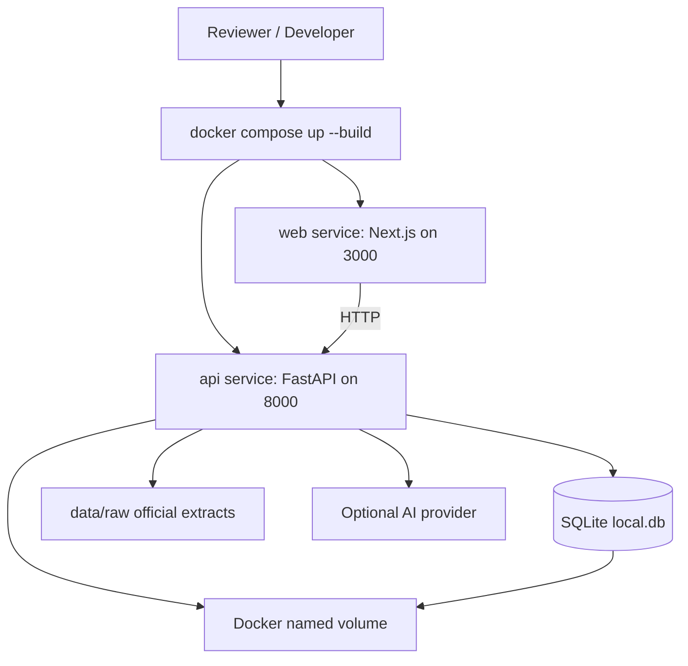
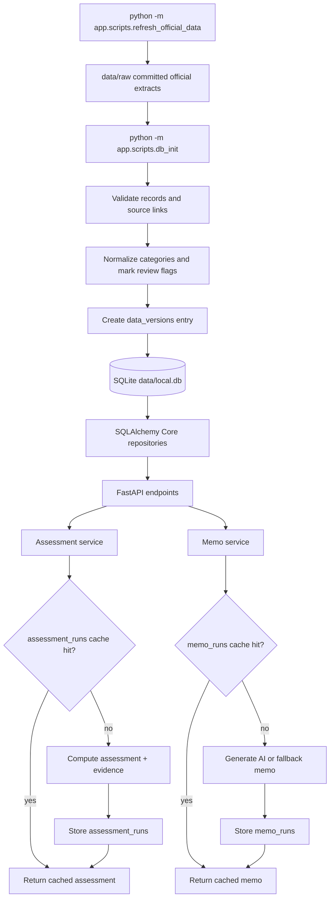
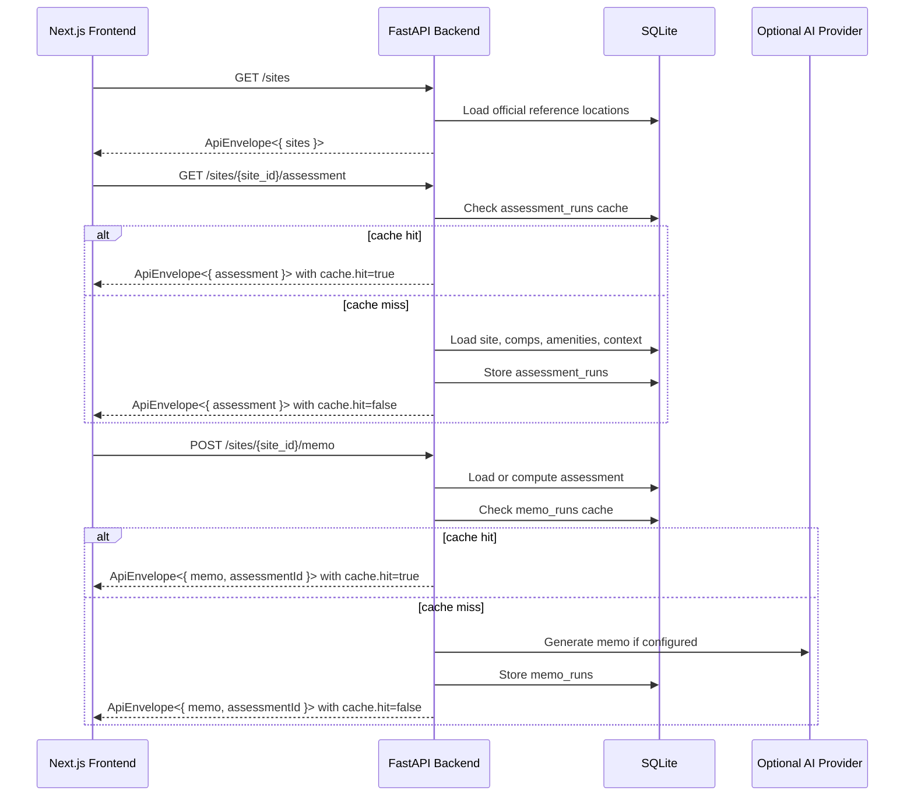
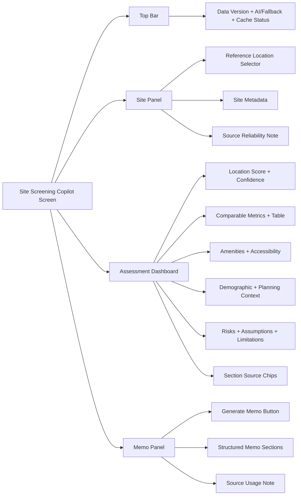

# Design Review: Site Screening Copilot

## 1. What This System Does

Site Screening Copilot is a focused full-stack MVP for early-stage Singapore residential site screening. A development analyst selects an official-data-backed HDB reference location, reviews structured evidence, and generates a first-pass memo grounded in backend-computed facts.

The important design principle is that AI is not the source of truth. The backend owns ingestion, validation, analytics, risk rules, confidence, provenance, and cache/audit records. AI only turns the bounded evidence packet into a memo when configured; otherwise the app returns a deterministic fallback memo.

## 2. Architecture At A Glance



## 3. Dockerized Local Runtime



Default reviewer path:

```bash
docker compose up --build
```

SQLite remains the MVP database so reviewers do not need to run a separate database service. Docker Compose provides repeatable Python/Node/runtime setup.

## 4. Data, Cache, And Provenance



The data path is hybrid: committed official extracts make the reviewer run deterministic, while `refresh_official_data` can regenerate them from HDB data.gov.sg and OneMap.

## 5. API Flow



MVP API surface:

```text
GET  /health
GET  /sites
GET  /sites/{site_id}/assessment
POST /sites/{site_id}/memo
```

## 6. AI Memo Guardrails

```mermaid
flowchart TD
  request[POST /sites/{site_id}/memo] --> assess[Load or compute SiteAssessment]
  assess --> evidence[Build EvidencePacket]
  evidence --> cache{memo_runs cache hit?}

  cache -->|yes| cached[Return cached GeneratedMemo]
  cache -->|no| configured{AI enabled and configured?}

  configured -->|no| fallback[Generate deterministic fallback memo]
  configured -->|yes| prompt[Build guarded prompt]

  prompt --> ai[Call AI provider]
  ai --> parse[Parse JSON]
  parse --> validate{Pydantic validation passes?}

  validate -->|yes| guardrails{Guardrail checks pass?}
  validate -->|no| repair[Retry once with repair prompt]

  repair --> parse2[Parse repaired JSON]
  parse2 --> validate2{Valid and safe?}

  validate2 -->|yes| store[Store memo_runs]
  validate2 -->|no| fallback

  guardrails -->|yes| store
  guardrails -->|no| repair

  fallback --> store
  store --> response[Return ApiEnvelope memo]
  cached --> response
```

AI is a constrained memo generator, not an autonomous agent. It cannot retrieve data, call tools, change scores, upgrade confidence, invent facts, or hide limitations.

## 7. Frontend Workflow



The first screen is the product itself: a single dashboard workflow, not a landing page, wizard, or chatbot.

## 8. Key Decisions

| Decision | Why | Tradeoff |
| --- | --- | --- |
| FastAPI backend + Next.js frontend | Keeps data/AI logic server-side and UI product-focused | Two services instead of one app |
| Docker Compose default runtime | Makes reviewer setup repeatable across machines | Adds Docker files and container lifecycle |
| SQLite local database | Free, local, deterministic, no separate DB service | Not production-scale |
| SQLAlchemy Core | Explicit SQL with a cleaner future Postgres path | Slightly more setup than direct `sqlite3` |
| Official HDB reference locations for MVP | Keeps vertical slice strong while avoiding synthetic comparables | Manual location input is deferred |
| Backend rule-based scoring | Explainable, testable, auditable | Simpler than production analytics |
| SQLite cache/audit tables | Repeatable assessments and memo cache without Redis | Cache invalidation must use versions |
| Optional AI + fallback | Reviewer can run without secrets while still supporting AI | Fallback memo is less expressive |
| Constrained generator, not agent | More consistent and safer for trust-sensitive memo writing | Less autonomous than a full agent |

## 9. What To Read Next

* [Product PRD](product.md) for scope, user journey, and product decisions.
* [Deep Technical Design](technical-design.md) for schemas, algorithms, API contracts, tests, and implementation sequencing.
