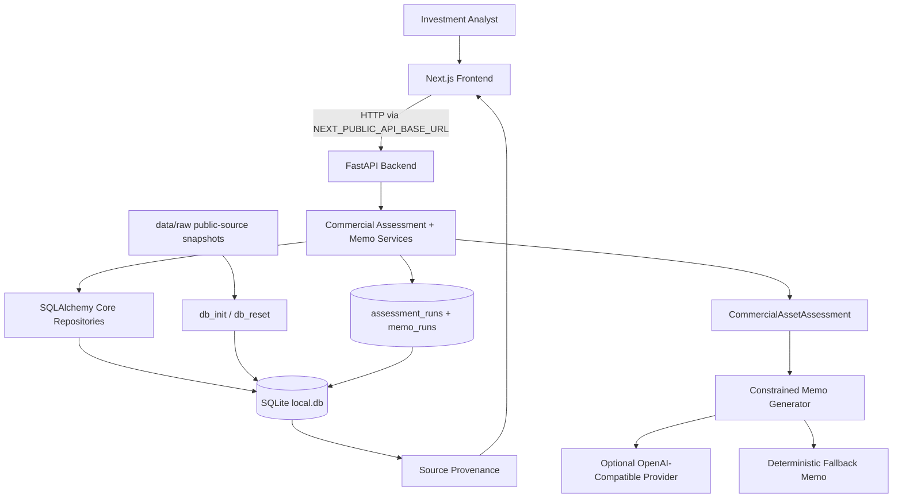
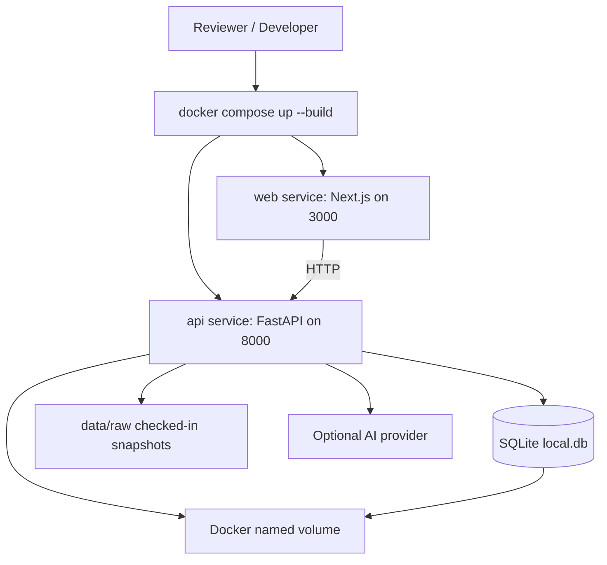
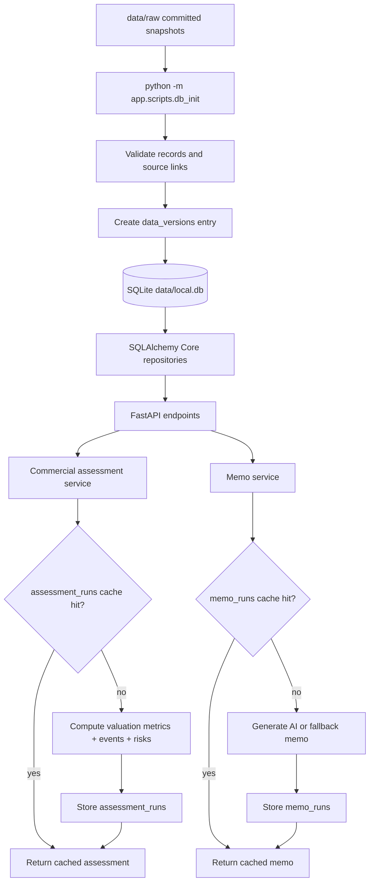
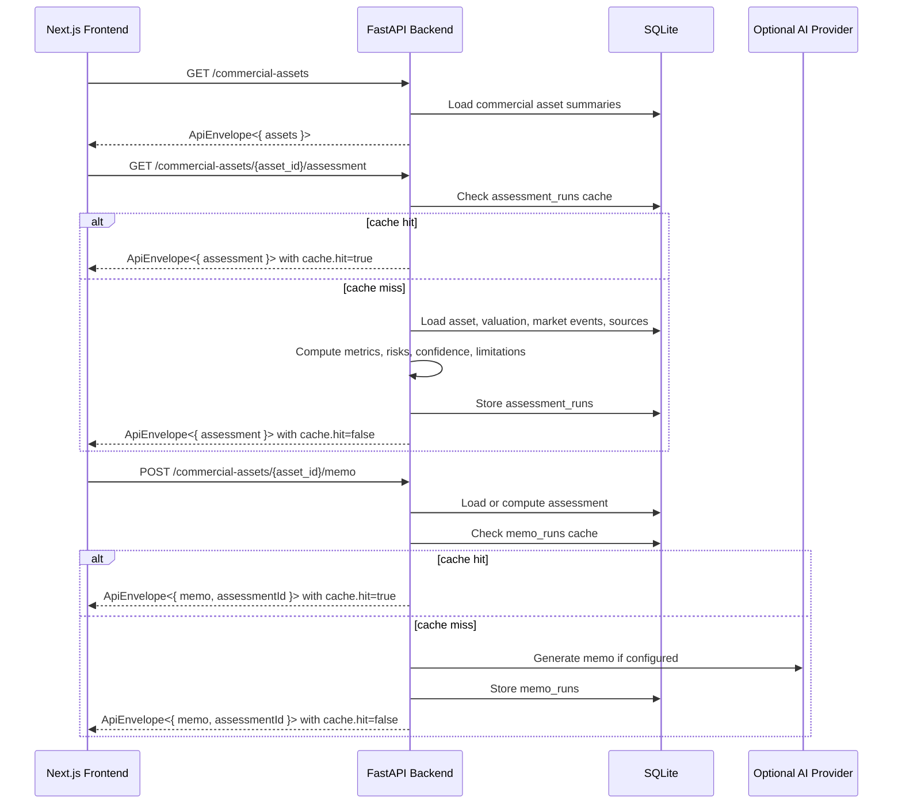
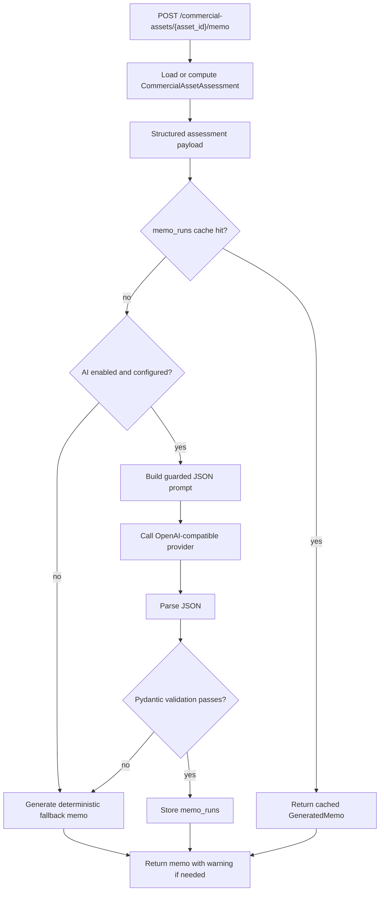
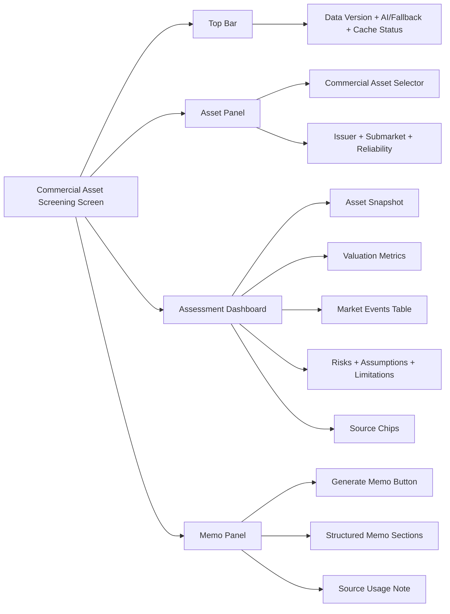

# Design Review: Commercial Asset Screening Copilot

## 1. What This System Does

Commercial Asset Screening Copilot is a focused full-stack MVP for first-pass Singapore commercial asset screening. An analyst selects a REIT or trust portfolio asset, reviews issuer-reported valuation metrics and structured market events, then generates a memo grounded in backend-computed facts.

The important design principle is that AI is not the source of truth. The backend owns ingestion, validation, analytics, risk rules, confidence, provenance, and cache/audit records. AI only turns the bounded assessment payload into a memo when configured; otherwise the app returns a deterministic fallback memo.

The backend still retains legacy residential `/sites` endpoints from the earlier vertical slice, but the active product workflow is `/commercial-assets`.

## 2. Architecture At A Glance



## 3. Dockerized Local Runtime



Default reviewer path:

```bash
docker compose up --build
```

SQLite remains the MVP database so reviewers do not need to run a separate database service. Docker Compose provides repeatable Python, Node, and runtime setup.

## 4. Data, Cache, And Provenance



The data path uses checked-in public-source snapshots so the reviewer run is deterministic. Commercial records include issuer portfolio pages, valuation records, and structured market events with source URLs. HDB and OneMap extracts remain in the repo only to support legacy residential endpoints.

## 5. API Flow



Primary API surface:

```text
GET  /health
GET  /commercial-assets
GET  /commercial-assets/{asset_id}/assessment
POST /commercial-assets/{asset_id}/memo
```

Legacy API surface still available:

```text
GET  /sites
GET  /sites/{site_id}/assessment
POST /sites/{site_id}/memo
```

## 6. AI Memo Guardrails



AI is a constrained memo generator, not an autonomous agent. It cannot retrieve data, call tools, change scores, upgrade confidence, invent facts, or hide limitations.

## 7. Frontend Workflow



The first screen is the product itself: a single dashboard workflow, not a landing page, wizard, or chatbot.

## 8. Key Decisions

| Decision | Why | Tradeoff |
| --- | --- | --- |
| Commercial asset workflow | Better matches the later product pivot and implemented frontend | Residential docs/endpoints become legacy support |
| FastAPI backend + Next.js frontend | Keeps data and AI logic server-side and UI product-focused | Two services instead of one app |
| Docker Compose default runtime | Makes reviewer setup repeatable across machines | Adds Docker files and container lifecycle |
| SQLite local database | Free, local, deterministic, no separate DB service | Not production-scale |
| SQLAlchemy Core | Explicit SQL with a cleaner future Postgres path | Slightly more setup than direct `sqlite3` |
| Public-source asset snapshot | Enables offline reviewer flow with source links | Not exhaustive market coverage |
| Backend rule-based metrics | Explainable, testable, auditable | Simpler than production underwriting |
| SQLite cache/audit tables | Repeatable assessments and memo cache without Redis | Cache invalidation must use versions |
| Optional AI + fallback | Reviewer can run without secrets while still supporting AI | Fallback memo is less expressive |
| Constrained generator, not agent | More consistent for trust-sensitive memo writing | Less autonomous than a full agent |

## 9. Reviewer Context

Approximate time spent was 9-10 hours total. The core working vertical slice was around 6-8 hours; the remaining time went into the commercial-scope pivot, source alignment, Docker and AI-provider setup, tests, GitHub publishing, and reviewer-ready documentation cleanup.

## 10. What To Read Next

* [Product PRD](product.md) for scope, user journey, and product decisions.
* [Deep Technical Design](technical-design.md) for schemas, endpoints, data model, tests, and setup.
