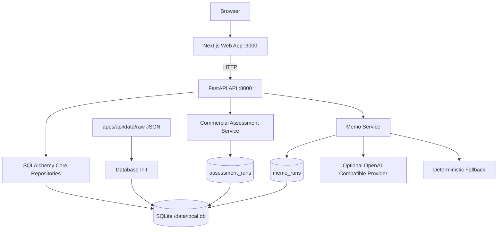

# Technical Design: Commercial Asset Screening Copilot

## 1. Executive Summary

Commercial Asset Screening Copilot is a Dockerized full-stack MVP for first-pass screening of Singapore commercial real estate assets. The current workflow lets an analyst select a REIT or trust portfolio asset, review valuation metrics and market events, inspect risks and limitations, and generate a grounded memo.

The central technical decision is to treat AI as a memo-writing layer over controlled backend facts, not as the source of market truth. The backend owns data ingestion, SQLite persistence, validation, valuation metrics, event matching, risk rules, confidence, source provenance, and cache/audit records. The AI layer receives a bounded assessment payload and must return a schema-valid memo only from that payload.

The implemented stack is:

```text
Backend:       Python, FastAPI, Pydantic
Frontend:      Next.js App Router, React, TypeScript, Tailwind CSS
Data:          SQLite initialized from checked-in raw JSON snapshots
DB Access:     SQLAlchemy Core repositories
AI Provider:   Optional OpenAI-compatible chat completion API
Runtime:       Docker Compose by default
Tests:         pytest for backend, TypeScript build/lint for frontend
```

## 2. Current Product Scope

The active product scope is Singapore commercial asset screening.

Primary user:

* Investment analyst
* Asset manager
* Development manager reviewing an existing or target commercial property

Primary workflow:

1. Select a commercial asset.
2. Review issuer, asset type, submarket, address, ownership, NLA, occupancy, and source note.
3. Review latest reported valuation, valuation psf, attributable value, and valuation basis.
4. Review relevant market events with buyer, seller, amount, stake, event type, and source URL.
5. Review risks, assumptions, limitations, missing fields, confidence, and sources.
6. Generate a memo using an optional AI provider or deterministic fallback.

The backend still exposes older residential `/sites` endpoints. They are retained as a working legacy slice and are not the primary frontend workflow.

## 3. Non-Goals

The MVP does not attempt to:

* Build a final valuation or NAV model.
* Calculate cap rates, NPI yield, IRR, gearing, or DPU impact without required issuer data.
* Integrate paid property databases.
* Scrape or store full paywalled article bodies.
* Support multi-user authentication or collaboration.
* Run live geocoding during reviewer startup.
* Replace professional appraisal, legal, planning, or investment committee judgment.
* Build a chatbot-first product.

## 4. Runtime Architecture



Docker Compose runs two services:

* `api`: FastAPI on port `8000`, with SQLite stored in a named Docker volume.
* `web`: Next.js on port `3000`, configured with `NEXT_PUBLIC_API_BASE_URL`.

SQLite is used because it is free, local, deterministic, and reviewer-friendly. Postgres remains the natural production direction, but it is unnecessary for the take-home runtime.

## 5. Repository Structure

```text
apps/
  api/
    app/
      api/
        routes.py
      db/
        schema.py
        init_db.py
        repositories.py
      models/
        api.py
        domain.py
      services/
        assessment.py        # legacy residential assessment
        commercial.py        # primary commercial assessment
        memo.py
        cache.py
        scoring.py           # legacy residential scoring
        normalization.py
      scripts/
        db_init.py
        db_reset.py
        refresh_official_data.py
    data/
      raw/
        commercial_assets.json
        asset_valuations.json
        market_events.json
        sources.json
        record_sources.json
        sites.json
        transactions.json
        amenities.json
    tests/
  web/
    app/
      page.tsx
    components/
    lib/
      api-client.ts
      types.ts
      format.ts
```

## 6. Data Model

### 6.1 Core Commercial Tables

`commercial_assets`

Stores asset identity and operating fields:

* `id`
* `issuer`
* `name`
* `address`
* `country`
* `asset_type`
* `submarket`
* `tenure`
* `ownership_interest_percent`
* `gross_floor_area_sqm`
* `net_lettable_area_sqm`
* `net_lettable_area_sqft`
* `occupancy_percent`
* `number_of_tenants`
* `carpark_lots`
* `source_note`

`asset_valuations`

Stores reported valuation rows:

* `id`
* `asset_id`
* `valuation_amount`
* `currency`
* `valuation_date`
* `valuation_scope`
* `valuation_basis`
* `source_id`

`valuation_scope` is important:

* `asset_100_percent`: valuation is a gross 100% asset value.
* `owned_interest`: valuation is already stated for the owned interest.
* `unknown`: attribution should not be inferred.

`market_events`

Stores structured event facts:

* `id`
* `event_date`
* `event_type`
* `title`
* `asset_name`
* `asset_type`
* `submarket`
* `buyer`
* `seller`
* `amount`
* `currency`
* `stake_percent`
* `stake_description`
* `area_sqft`
* `source_url`
* `source_id`
* `extraction_confidence`
* `needs_review`
* `summary`
* `counterparties_json`

### 6.2 Provenance And Runtime Tables

`sources`

Stores source metadata:

* `id`
* `label`
* `publisher`
* `url`
* `retrieved_at`
* `data_vintage`
* `reliability`
* `notes`

`record_sources`

Links records to sources through:

* `record_type`
* `record_id`
* `source_id`

`data_versions`

Stores a hash of raw JSON files so assessments can be tied to a specific data snapshot.

`assessment_runs`

Stores cached assessment JSON with algorithm version and cache key.

`memo_runs`

Stores cached memo JSON with prompt version, provider, model, and tone.

### 6.3 Legacy Residential Tables

The following tables remain because the backend still supports residential `/sites` endpoints:

* `sites`
* `transactions`
* `amenities`
* `demographics`
* `planning_contexts`

These are no longer the primary frontend workflow.

## 7. Raw Data

Commercial raw data files:

* `commercial_assets.json`
* `asset_valuations.json`
* `market_events.json`
* `sources.json`
* `record_sources.json`

Current commercial coverage:

* OUE REIT assets with official issuer-reported valuations.
* CICT assets with official issuer-reported valuations.
* Keppel REIT, Suntec REIT, and MPACT representative assets with source-backed identity and explicit missing valuation fields.
* Selected Business Times market-event facts stored as structured data with source URLs and review flags.

Residential raw data files remain for legacy endpoints:

* `sites.json`
* `transactions.json`
* `amenities.json`
* `demographics.json`
* `planning_contexts.json`

HDB registration dates are month-level, so they are stored as `YYYY-MM-01` for sorting. They should not be interpreted as exact transaction dates.

## 8. Commercial Assessment Service

The commercial service exposes:

* `list_commercial_asset_summaries`
* `assess_commercial_asset`

Assessment steps:

1. Resolve current `data_version`.
2. Build cache key from `commercial`, `asset_id`, `data_version`, and algorithm version.
3. Load cached `CommercialAssetAssessment` if available.
4. Load asset row, valuations, market events, record sources, and source records.
5. Select latest valuation by `valuation_date`.
6. Compute NLA sq ft from loaded sq ft or sqm.
7. Compute valuation psf when valuation and NLA are present.
8. Compute attributable value when valuation scope and ownership support it.
9. Match relevant market events by submarket, asset type, or asset name.
10. Build missing-data list.
11. Derive risk items.
12. Compute confidence.
13. Persist assessment cache.
14. Return `ApiEnvelope` metadata with cache and warning information.

## 9. Metrics

### 9.1 Valuation PSF

```text
valuation_psf = valuation_amount / net_lettable_area_sqft
```

Only computed when both fields are available.

### 9.2 Attributable Value

```text
if valuation_scope == "owned_interest":
  attributable_value = valuation_amount

if valuation_scope == "asset_100_percent" and ownership_interest_percent exists:
  attributable_value = valuation_amount * ownership_interest_percent / 100
```

If valuation scope is unknown, the app does not infer an attributable value.

### 9.3 Market Event Matching

An event is relevant when:

* `event.submarket == asset.submarket`
* or `event.assetType == asset.assetType`
* or the event asset name overlaps the selected asset name

The UI shows up to the most relevant recent events, with review flags where extraction confidence is not fully deterministic.

## 10. Risk And Confidence

Risk rules are deterministic and run before memo generation.

Risk examples:

* Missing valuation: high data risk.
* Missing occupancy: medium data risk.
* No same-submarket event: medium market risk.
* Narrative-source event needs review: medium data risk.
* Partial ownership: low data risk.

Confidence starts from `100` and deducts for missing or weaker evidence:

* Missing valuation
* Missing NLA
* Missing occupancy
* No same-submarket event
* Press-source event requiring verification
* Structured event fields marked `needs_review`

The memo may explain confidence but cannot increase it.

## 11. API Design

All main API responses use:

```ts
type ApiEnvelope<T> = {
  data: T;
  meta: {
    requestId: string;
    generatedAt: string;
    dataVersion?: string;
    cache?: {
      hit: boolean;
      key?: string;
      source: "cache" | "computed";
    };
    warnings: string[];
  };
};
```

Primary commercial endpoints:

```text
GET /health
GET /commercial-assets
GET /commercial-assets/{asset_id}/assessment
POST /commercial-assets/{asset_id}/memo
```

Legacy residential endpoints:

```text
GET /sites
GET /sites/{site_id}/assessment
POST /sites/{site_id}/memo
```

### 11.1 `GET /commercial-assets`

Returns selectable commercial asset summaries:

```ts
{
  assets: CommercialAssetSummary[];
}
```

Each summary includes issuer, name, address, asset type, submarket, latest valuation, valuation psf, occupancy, and data reliability.

### 11.2 `GET /commercial-assets/{asset_id}/assessment`

Returns:

```ts
{
  assessment: CommercialAssetAssessment;
}
```

The assessment includes:

* `asset`
* `metrics`
* `marketEvents`
* `riskAssessment`
* `confidence`
* `assumptions`
* `limitations`
* `sources`

### 11.3 `POST /commercial-assets/{asset_id}/memo`

Request:

```json
{
  "tone": "investment-committee"
}
```

Response:

```ts
{
  memo: GeneratedMemo;
  assessmentId: string;
  generation: {
    provider: "openai-compatible" | "fallback";
    model?: string;
    promptVersion: string;
    generatedAt: string;
    groundingSourceIds: string[];
    usedFallback: boolean;
  };
}
```

## 12. AI Memo Design

The memo service supports two paths:

1. OpenAI-compatible provider when `ENABLE_AI_MEMO=true`, `AI_API_KEY` is set, and `AI_MODEL` is set.
2. Deterministic fallback when AI is disabled, missing, or fails.

Environment variables:

```env
ENABLE_AI_MEMO=false
AI_PROVIDER=openai-compatible
AI_API_KEY=
AI_MODEL=
AI_BASE_URL=https://api.openai.com/v1
```

The AI request uses:

* Backend-built system prompt
* Structured assessment JSON
* JSON object response format
* Pydantic validation into `GeneratedMemo`

The AI may:

* Summarize and organize the memo.
* Explain risks and limitations.
* Turn backend facts into readable prose.

The AI may not:

* Retrieve external data.
* Call tools.
* Invent buyers, sellers, dates, values, source names, or planning facts.
* Upgrade confidence.
* Hide missing fields.

## 13. Frontend Design

The frontend is a single product screen:

* Header with data and backend-rule status.
* Left asset selector.
* Main assessment dashboard.
* Right memo panel.

Main sections:

* Asset snapshot
* Valuation metrics
* Market events table
* Risks
* Assumptions and limitations
* Sources
* Memo

The frontend does not compute business logic. It calls the backend through `apps/web/lib/api-client.ts` and renders typed response models from `apps/web/lib/types.ts`.

## 14. Caching

Assessment cache:

```text
commercial assessment cache key =
sha256("commercial" | asset_id | data_version | algorithm_version)
```

Residential assessment cache additionally includes the current Singapore `asOfDate`, because residential comparable recency changes with time.

Memo cache:

```text
memo cache key =
sha256(assessment_id | prompt_version | provider | model | tone)
```

Cache rows are stored in SQLite, not Redis. This is sufficient for local MVP review and gives useful metadata to the UI.

## 15. Setup

Default:

```bash
docker compose up --build
```

Backend tests:

```bash
cd apps/api
python -m pytest
```

Frontend checks:

```bash
cd apps/web
npm run lint
npm run build
```

Optional AI:

```bash
cp .env.example .env
```

Then set:

```env
ENABLE_AI_MEMO=true
AI_API_KEY=your_api_key_here
AI_MODEL=your_model_name_here
AI_BASE_URL=https://api.openai.com/v1
```

## 16. Tests

Backend test coverage includes:

* Health endpoint.
* Commercial asset list endpoint.
* Commercial assessment endpoint and cache metadata.
* Commercial memo endpoint and fallback cache metadata.
* Unknown commercial asset error structure.
* Database initialization and source-link validation.
* Residential legacy assessment and scoring behavior.
* Fallback memo generation.
* OpenAI-compatible memo path using a stubbed provider call.

Recommended commands before handoff:

```bash
cd apps/api
python -m pytest
```

```bash
cd apps/web
npm run lint
npm run build
```

## 17. Security And Secrets

Secrets are not committed.

Ignored local secret files:

* `.env`
* `apps/api/.env`
* `apps/web/.env.local`

AI API keys stay server-side in the FastAPI service. The frontend never receives the key.

## 18. Production Path

Natural next steps:

* Replace curated JSON snapshots with repeatable issuer and SGX extraction jobs.
* Add Postgres and migration tooling.
* Add appraiser assumptions, NPI, WALE, top tenants, debt, and cap-rate fields.
* Add issuer-level NAV and unit-price analytics.
* Add scheduled market-event ingestion and analyst review queues.
* Add authentication and role-based access.
* Add a monitored deployment with structured logs and error tracking.

## 19. Design Decisions

### ADR-001: Commercial Asset Workflow

Decision: Make Singapore commercial asset screening the primary workflow.

Reason: The later product pivot better matches asset monitoring and investor questions around REIT portfolios, valuation, stakes, buyers, sellers, and recent market events.

Consequence: Residential HDB endpoints remain as legacy support, but docs and UI should focus on commercial assets.

### ADR-002: Rule-Based Analytics Before AI

Decision: Compute valuation metrics, risks, confidence, and limitations before memo generation.

Reason: This keeps trust-sensitive logic deterministic and testable.

Consequence: AI is less autonomous but safer and easier to audit.

### ADR-003: Optional AI With Fallback

Decision: Memo generation must work without an AI key.

Reason: Reviewers may not configure secrets. A broken memo button would undermine the demo.

Consequence: The fallback memo is less expressive, but the app remains runnable.

### ADR-004: SQLite Local Runtime

Decision: Use SQLite for the MVP runtime database.

Reason: It is free, local, Docker-friendly, and enough to demonstrate relational modeling, provenance joins, and cache/audit tables.

Consequence: Production should move to Postgres once ingestion volume and multi-user access matter.

### ADR-005: Constrained Generator Over Agent

Decision: Use a constrained memo generator, not a tool-using AI agent.

Reason: The backend already has the facts. Letting AI retrieve or mutate data would weaken auditability.

Consequence: The AI layer is less autonomous but more consistent for investment memo drafting.
